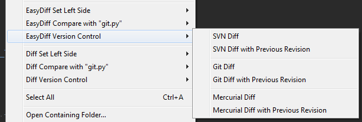

[![Donate via PayPal][donate-image]][donate-link]
[![Package Control Downloads][pc-image]][pc-link]
![License][license-image]
# EasyDiff
EasyDiff is a diff tool for comparing files in Sublime Text in special diff tabs or in your preferred external diff viewer.

# Features
-   Allows comparing views, selections, multi-selections, and clipboard combinations.
-   Can compare working copy against the base or previous revision of a file in SVN, Git, and Mercurial (requires some
    setup and configuration).
-   Dynamic context menus for selecting left side and right side compare.  Dynamic menus show what file is on *left*
    side (think Beyond Compare context menus).
-   View diffs in a view buffer or output panel.
-   You can selectively hide version control menus or disable the command completely via the settings file.
-   Can open diffs in external diff programs if desired (requires some setup and configuration).
-   Show only internal diff options, only external options, or show both depending on your needs and preferences.

# Documentation
http://facelessuser.github.io/EasyDiff/

# License
EasyDiff is released under the MIT license.

[pc-image]: https://img.shields.io/packagecontrol/dt/EasyDiff.svg?labelColor=333333&logo=sublime%20text
[pc-link]: https://packagecontrol.io/packages/EasyDiff
[license-image]: https://img.shields.io/badge/license-MIT-blue.svg?labelColor=333333
[donate-image]: https://img.shields.io/badge/Donate-PayPal-3fabd1?logo=paypal
[donate-link]: https://www.paypal.me/facelessuser
